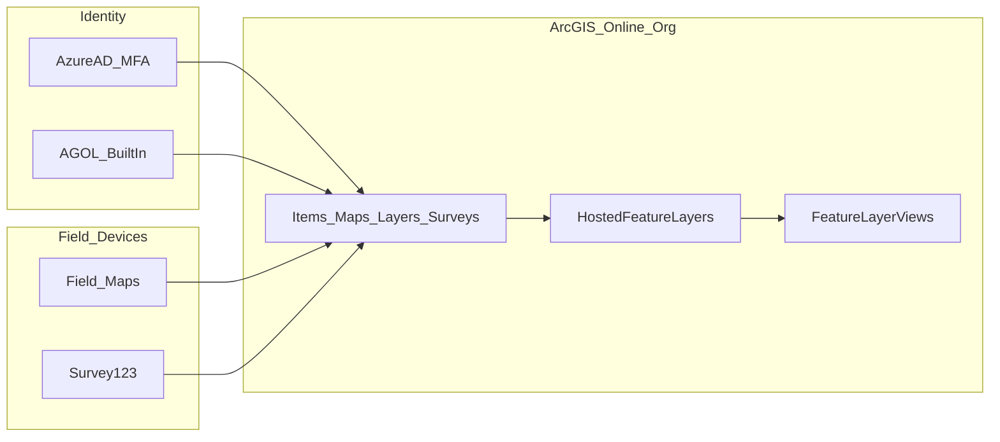

# ArcGIS Field Maps and Survey123: ArcGIS Online–Only Deployment Plan

## Scope

- **Goal**: Field staff **read, create, and update** data using **Field Maps** (map-first) and **Survey123** (form-first) in a **single ArcGIS Online organization**, with **offline** maps/surveys and **daily sync**, **editor tracking** where enabled, and **sensitive-data** controls.
- **Scale**: ~**20** field workers, ~**25** field maps, ~**25** surveys.
- **Platforms**: **iOS** and **Android**; default Esri basemaps.
- **Identity**: **Azure AD enterprise logins** with **MFA** plus **built-in** ArcGIS accounts where approved (break-glass, exceptions).
- **Not in scope for this workflow**: ArcGIS Enterprise Portal, federated servers, **enterprise geodatabase branch versioning**, or **registered enterprise** feature services. Authoritative data for these apps lives in **ArcGIS Online hosted feature layers** (and related tables) unless you later add a separate sync pipeline from outside AGOL.

**Optional alignment**: If you still maintain an enterprise ETL practice (e.g. [arcgis_enterprise_etl_plan_db5830ad.plan.md](c:\Users\cbird\Documents\gis_jobs\.cursor\plans\arcgis_enterprise_etl_plan_db5830ad.plan.md)), treat it as **upstream of AGOL**—define how refreshed data reaches **hosted** layers without fighting field edits—not as part of this AGOL-only field runtime.

---

## 1) Target architecture (ArcGIS Online only)

**System of record**: One **ArcGIS Online organization** holds **web maps**, **hosted feature layers**, **feature layer views**, **Survey123** form items, and **groups** used for sharing. Field Maps and Survey123 on devices authenticate to **this org** and consume **items shared to field-worker groups**.

*Many Markdown previews (including Cursor’s) do not render Mermaid diagrams; the figure below is plain text so it always displays. For a graphical version, paste the Mermaid source into [Mermaid Live Editor](https://mermaid.live).*

```text
                         ┌──────────────────────────────────────────────┐
                         │        ArcGIS Online organization            │
   Identity              │                                              │
 ┌──────────────────┐    │   Items (web maps, surveys, layer items)     │
 │ Azure AD + MFA   │───►│        │                                     │
 └──────────────────┘    │        ▼                                     │
 ┌──────────────────┐    │   Hosted feature layers                      │
 │ Built-in AGOL    │───►│        │                                     │
 └──────────────────┘    │        ▼                                     │
                         │   Feature layer views                        │
                         └───────────────────────────▲──────────────────┘
                                                     │
                        ┌────────────────────────────┼────────────────────────────┐
                        │                            │                            │
                        ▼                            │                            ▼
                 Field Maps                    (same org items)            Survey123
              iOS / Android                                                    iOS / Android
```

**Optional — same diagram in Mermaid** (renders on GitHub; otherwise paste into [Mermaid Live Editor](https://mermaid.live)):



**Decisions to document**

- **Naming and lifecycle**: conventions for maps, layers, surveys, and views (dev/test/prod if you use separate folders or groups).
- **Credits and storage**: baselines for **hosting**, **attachments**, and **offline** downloads; who approves growth.
- **Sensitive vs standard**: which layers/maps/surveys belong in **restricted groups** and whether **views** mask fields for mobile.

---

## 2) Identity and access (built-in + Azure AD + MFA)

- **Azure AD**: Configure **enterprise logins** on the ArcGIS Online org (SAML or OIDC per current Esri documentation). Enforce **MFA in Azure AD** (Conditional Access).
- **Built-in accounts**: Limited, approved use (vendors, break-glass); **least privilege**, periodic access review, and monitoring.
- **Roles**: Separate **publishers/GIS admins** from **field editors** (custom roles as needed—e.g. restrict sharing or analysis if policy requires).
- **Groups**: **Field Workers** (all ~20 users); optional **sub-teams** for regional maps/offline areas; **separate groups** for sensitive content (see section 6).
- **Mobile MFA**: Document **token refresh**, password changes, and support steps for iOS/Android Field Maps and Survey123.

---

## 3) Data model and hosted services

**Hosted feature layers**

- Primary pattern: **hosted feature layers** in AGOL (created from Survey123 publish, from ArcGIS Pro publish to AGOL, or from other approved workflows).
- **Editor tracking**: Enable where supported and validate updates from **Field Maps** and **Survey123**.
- **Domains, subtypes, relationships, attachments**: Design in **ArcGIS Pro** (or equivalent) before wide rollout; use **overwrite** or controlled schema migration with a **field-app compatibility** check.
- **Feature layer views**: Use for **field visibility**, filters, and **sensitivity** (separate views for mobile vs internal analysis if needed).

**Versioning note (AGOL)**

- **Enterprise branch versioning** does not apply to standard **ArcGIS Online hosted** editing in the same way as an enterprise geodatabase. Governance focuses on **layer permissions**, **editor tracking**, **backup/export** strategy, and **change control**—not reconcile/post against branch versions.

**External data refresh (if any)**

- If authoritative data is maintained outside AGOL, define **one-direction** refresh (e.g. overwrite **staging** layers, append tools, FME/Notebooks) and **which layers are field-editable** vs **refreshed-only** to avoid overwrite conflicts.

---

## 4) Field Maps deployment (map-first)

- **Chain**: ArcGIS Pro → **web map** → **Field Maps Designer** (forms, offline, smart behaviors).
- **Per-map** (~25): layer order, pop-ups, editable fields, attachments policy, **offline map areas** sized for devices, sharing to correct groups.
- **Daily sync SOP**: Wi-Fi sync windows, error handling, no force-quit during sync.

---

## 5) Survey123 deployment (form-first)

- **Chain**: **Survey123 Connect** (XLSForm) → **publish to ArcGIS Online** → share to groups.
- **Layer binding**: Prefer **publish the hosted feature layer first** (or a stable schema from Pro), then **connect the survey** for governance and shared use with Field Maps (see **Survey123 lifecycle Q&A** below).
- **Create vs update**: Design **inbox** and/or **URL parameters** where users update existing features; document handoffs with Field Maps.

---

## 6) Sensitive data controls

- **Tier A**: Restricted groups; maps that **omit** unauthorized layers; **views** that drop or restrict fields; minimal sharing links.
- **Tier B**: Standard group access.
- **Defense in depth**: Conditional Access / app protection if required; device encryption; training on screenshots and lost devices.
- **Audit**: AGOL **activity** where available + **editor tracking** on features.

---

## 7) Device options

- **Primary**: Current **Field Maps** and **Survey123** on iOS and Android.
- **Rugged Android**: Same apps; validate GPS and storage.
- **Windows tablets**: Office/browser use; not a full substitute for mobile field apps.
- **Survey123 web**: Useful for office/kiosk; not a replacement for full offline mobile workflows.

---

## 8) Testing and rollout phases

1. **Smoke**: AAD + MFA sign-in on mobile; built-in fallback test; one simple hosted layer + one map + one survey.
2. **Offline/sync stress**: Large offline areas, attachments, related records, poor connectivity.
3. **Pilot**: 3–5 users, hardest 2–3 maps and surveys.
4. **Scale-out**: Templates and naming; **catalog** (owner, group, offline extent, sensitivity, related integrations).

---

## 9) Operations, support, and governance

- **Ownership**: Named owner per map, survey, and layer.
- **Change management**: Schema changes and survey updates with regression checks on mobile.
- **Monitoring**: Credits, storage, submission volume (layer + webhooks—see lifecycle Q&A); help-desk path for **outbox** errors.
- **Backup/DR**: AGOL **export** strategy (scheduled layer export, scripted backup per org policy), item recovery expectations, and communication if layers are restored after field offline work.

---

## 10) Deliverables checklist

- Architecture memo: **AGOL-only** system of record, groups, and where each of ~25 maps and ~25 surveys lives.
- Identity: AAD + MFA, built-in exception process, roles.
- Data standards: hosted layer conventions, editor tracking, views, refresh rules vs field edits.
- Mobile SOP: offline, daily sync, errors.
- Security packet for sensitive layers.
- Test scripts and pilot report template.

---

## Technical lead overview: Survey123 lifecycle (ArcGIS Online)

GIS analysts typically **build surveys and wire layers**; the **technical lead** owns **clarity, integration risk, delivery, and operations**. Below is an end-to-end lifecycle with **ArcGIS Online** in mind.

### Step 1 — Discovery and alignment (initial meetings)

**Purpose**: Turn “we need a survey” into a bounded deliverable tied to **one AGOL org**, **one sharing model**, and a clear **hosted layer** target.

**Lead focus**: Stakeholders, approvals, **which hosted layer** receives data, **who submits vs views results**, offline/attachment expectations, sensitive fields, definition of done.

**Analysts**: Draft questions and data implications; no production publish required yet.

### Step 2 — Solution design (freeze the integration shape)

**Purpose**: Agree **how Survey123 connects to AGOL** before heavy XLSForm work. *Freezing the integration shape* means locking **where data lives (layer item id / URL), create vs update behavior (inbox, URL params), related tables/repeats, security (groups, views), and downstream consumers*—then treating changes as **controlled releases**.

**Lead focus**: Feature layer schema contract, views for sensitivity, webhooks/automation endpoints, credit/storage impact.

**Analysts**: Validate schema and publish path with the lead.

### Step 3 — Build (survey + layers)

**Purpose**: Implement the form and **hosted** plumbing.

**Lead focus**: Standards (naming, choice lists, attachments), review gates, performance risks (large repeats, big images).

**Analysts**: Survey123 Connect; publish to **AGOL**; bind to hosted feature layer (prefer **layer published first** when schema is shared with Field Maps or governance matters).

### Step 4 — Integration and automation (as needed)

**Purpose**: Connect submissions to reporting, email, ticketing, or data warehouses.

**Lead focus**: Webhooks (Survey123 or **feature layer** webhooks in AGOL), Power Automate or equivalent, **idempotent** downstream jobs (see Q&A).

**Analysts**: Support field mappings and test data.

### Step 5 — Test and UAT

**Purpose**: Prove **real devices**, **real accounts**, **real groups**, and **offline** behavior.

**Lead focus**: Matrix (iOS/Android, online/offline, MFA), attachment stress, sharing mistakes (over-sharing).

**Analysts**: Execute tests; fix survey/layer issues.

### Step 6 — Deployment and cutover

**Purpose**: Production items, training, support model.

**Lead focus**: Promotion process (if dev/test orgs or groups), communications, rollback concept (revert sharing or survey version).

**Analysts**: Final publish, verify sharing.

### Step 7 — Operate and improve

**Purpose**: Healthy surveys after go-live.

**Lead focus**: Change control, monitoring (rates, anomalies), access reviews for sensitive surveys.

**Analysts**: Seasonal tweaks and fixes.

### RACI snapshot (AGOL context)

| Area | Technical lead | GIS analysts |
|------|----------------|--------------|
| Stakeholders, risk, integrations | Owns | Supports |
| AGOL groups, roles, security design | Co-owns / approves | Implements under standards |
| XLSForm, publish, inbox/URL behavior | Reviews | Owns |
| UAT plan, go-live, support | Owns | Executes fixes |

---

## Reference: Answers to lifecycle-related questions (ArcGIS Online)

### What does “freeze the integration shape” mean?

It means **decide and document** how Survey123 plugs into **ArcGIS Online**: target **hosted feature layer**, create vs update pattern, repeats/related tables, **groups and views**, webhooks, and consumers. **Freeze** = treat that contract as stable for the release so analysts are not rebuilding against a moving schema or wrong item.

### What are **inbox** and **URL parameters** (create vs update)?

- **Inbox**: Survey123 downloads a **queue of existing features** from the layer (query-based); users open one record to **edit/update** in the app—good for assigned work at scale.
- **URL parameters**: A **link** (e.g. from Field Maps, email, QR) opens the survey **scoped or pre-filled** to a specific feature or key—good for deep links to one asset.

### How can we load test surveys (AGOL)?

Treat load testing primarily as **authenticated concurrent writes** to the **feature layer** (`applyEdits`, attachments)—using scripts or tools (e.g. k6, Locust, JMeter, Python)—with **test layers** and realistic payloads. **Coordinate with org policy** on high-volume testing against **ArcGIS Online** (throttling, acceptable use, credits). **Inbox/query** load can be tested separately. Client-only offline behavior is still validated in **pilot**, not only by REST load tests.

### What does “idempotency and ops: retry behavior, failure alerts, who monitors” mean?

- **Idempotency**: Automations (webhooks → flows → databases) should **not duplicate** work when a message is retried—use stable IDs and dedupe logs.
- **Retry behavior**: Retry **transient** errors with backoff; **stop and alert** on permanent errors (403, schema mismatch).
- **Failure alerts**: Notify owners when flows fail or error rates spike.
- **Who monitors**: Named roles for **submission health** (GIS vs integration vs help desk) and escalation paths.

### Can we monitor Survey123 for submission rates and errors (AGOL)?

- **Success path**: **Webhooks** (Survey123 or feature layer) to increment metrics or log rows; **scheduled queries** on the layer (counts by time/editor tracking) for **submission rate** baselines.
- **Server-visible failures**: Failed REST calls may appear in **automation logs** or platform diagnostics where you have access; AGOL does not give one turnkey “Survey123 sync dashboard” for every client failure.
- **Client failures**: Often visible in the **app outbox**—complement with **training** and support procedures.

### Do we need to publish GIS services to *develop* a Survey123 survey?

- **Authoring in Connect**: **No**—build locally.
- **Deploying for real use in AGOL**: You need a **feature layer destination**—either **created when the survey is published** or **pre-published** and connected. For shared schema with Field Maps and strong governance, **publish the layer first** is usually preferred.

### Advantages of publishing the hosted layer first, then connecting the survey

- **Controlled schema** aligned with Pro/domains/relationships and **editor tracking**.
- **One layer** for Field Maps, dashboards, and Survey123.
- **Clear security** via groups and **feature layer views** before the survey exists.
- **Easier testing and monitoring** of the service independent of form logic.

### What is a **repeat** in Survey123?

A **repeat** is a **repeating block** of questions in one submission (e.g. multiple defects on one inspection)—often mapped to **related records** in a related table.

**Utility example**: One **hydrant inspection** (parent feature) with a repeat **“Issues found”** (issue type, severity, notes, photo per row)—still one send; many child records.

---

## Narrative on Step 1 (ArcGIS Online architecture)

The first priority is making the **ArcGIS Online organization** the clear **system of record** for this field program: every map, hosted layer, view, and survey item has a defined **owner**, **group**, and **sensitivity tier**. This is important because a single org simplifies sign-in and support, but it also concentrates risk—without explicit boundaries, sensitive layers can be over-shared or duplicated across unofficial copies. A well-documented architecture gives authors a single place to publish, gives security teams a clear audit surface, and gives operations predictable levers for credits, storage, and backup. For roughly twenty users and fifty curated items, the payoff is standardization: templates, naming, and onboarding stay repeatable as the program grows.

### Three critical questions for Step 1

1. Is **100%** of authoritative data for these workflows stored in **AGOL hosted layers**, and are any exceptions explicitly approved?
2. How are **sensitive** layers isolated (groups, views, separate maps), and who approves membership changes?
3. What are the **credit and storage** baselines and approval process when offline areas or attachments grow?

---

## Narrative on Step 2 (Identity and access on ArcGIS Online)

Identity work turns policy into day-to-day reliability: **Azure AD with MFA** for the majority of users, **built-in** accounts only where justified, and **custom roles** that match what field staff actually need—not generic admin defaults. This matters because mobile GIS fails in the field when permissions are wrong, and it fails audits when permissions are too loose. On ArcGIS Online, consistency between **enterprise logins**, **group sharing**, and **item URLs** reduces help-desk churn and speeds troubleshooting. Clear break-glass rules show maturity in business continuity without turning alternate credentials into shadow IT. For leadership, this step demonstrates disciplined least-privilege access at a scale appropriate to a focused field workforce.

### Three critical questions for Step 2

1. Which **privileges** does each role require (view, edit, export, share), and which must remain denied?
2. Under what conditions are **built-in** accounts issued, approved, and reviewed?
3. How do **Conditional Access** and MFA behave on **iOS and Android** for Field Maps and Survey123, including renewal and recovery?

---

## Narrative on Step 3 (Hosted data model and editing governance)

Step 3 defines how **hosted feature layers** behave under real editing load from two apps: **Field Maps** and **Survey123**. The work includes schema standards, **editor tracking**, **views** for mobile, attachments policy, and rules for any **external refresh** into AGOL that must not clobber field edits. This step is important because ArcGIS Online’s strength—centralized, easy sharing—becomes a liability if schema drift, duplicate layers, or unclear ownership of fields undermine trust. Good governance makes offline sync predictable and makes reporting dependable. For an interview panel, this is where you show the program is not only “mobile-enabled” but **data-governed** in the cloud.

### Three critical questions for Step 3

1. Which layers are **field-editable** versus **refreshed from outside AGOL**, and how are overwrites prevented?
2. Which standards apply to all maps and surveys (**domains, relationships, attachments, editor tracking**), and who signs off before publish?
3. What is the **backup and export** cadence for critical hosted layers, and how do restores interact with **pending offline** work?
